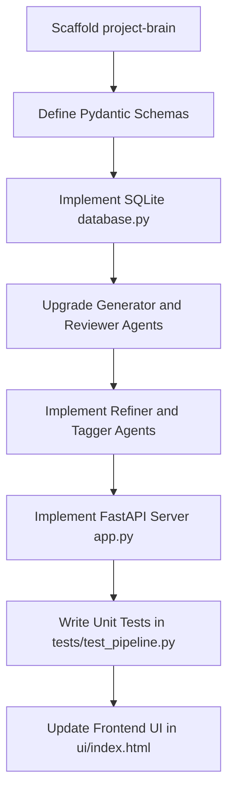

# Project Brain v2 - Task Dependencies

```mermaid
graph TD
    A[Scaffold project-brain] --> B[Define Pydantic Schemas]
    B --> C[Implement SQLite database.py]
    C --> D[Upgrade Generator and Reviewer Agents]
    D --> E[Implement Refiner and Tagger Agents]
    E --> F[Implement FastAPI Server app.py]
    F --> G[Write Unit Tests in tests/test_pipeline.py]
    G --> H[Update Frontend UI in ui/index.html]
```
